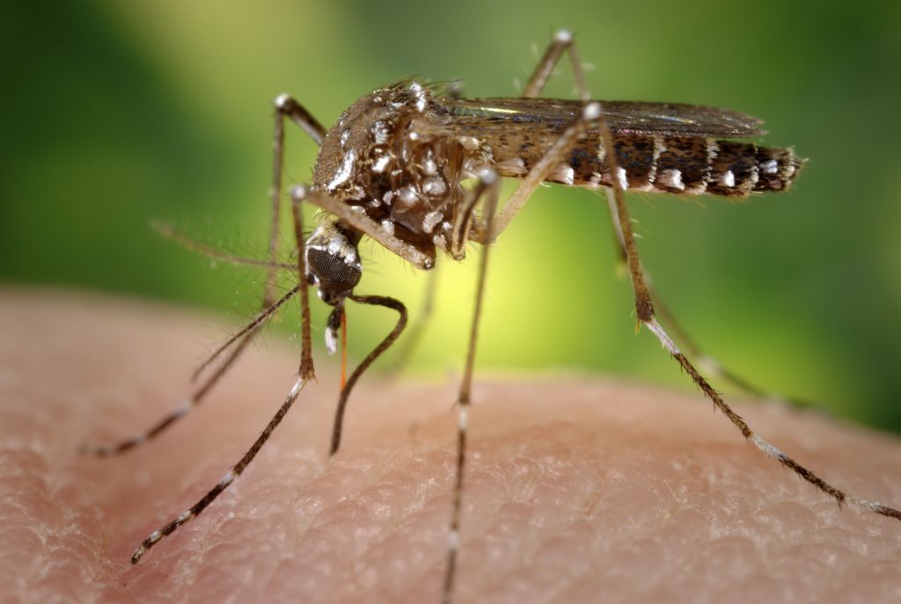

# DengAI-Predicting-Disease-Spread
Drivendata: DengAI: Predicting Disease Spread

[Competition Link](https://www.drivendata.org/competitions/44/dengai-predicting-disease-spread/page/80/)

#### Can you predict local epidemics of dengue fever?

Dengue fever is a mosquito-borne disease that occurs in tropical and sub-tropical parts of the world. In mild cases, symptoms are 
similar to the flu: fever, rash, and muscle and joint pain. In severe cases, dengue fever can cause severe bleeding, 
low blood pressure, and even death.
Because it is carried by mosquitoes, the transmission dynamics of dengue are related to climate variables such as temperature
and precipitation. Although the relationship to climate is complex, a growing number of scientists argue that climate change 
is likely to produce distributional shifts that will have significant public health implications worldwide.
In recent years dengue fever has been spreading. Historically, the disease has been most prevalent in Southeast Asia and the 
Pacific islands. These days many of the nearly half billion cases per year are occurring in Latin America

#### Predict the Next Pandemic Initiative

The data for this competition comes from multiple sources aimed at supporting the Predict the Next Pandemic Initiative. 
Dengue surveillance data is provided by the U.S. Centers for Disease Control and prevention, as well as the Department 
of Defense's Naval Medical Research Unit 6 and the Armed Forces Health Surveillance Center, in collaboration with the Peruvian 
government and U.S. universities. Environmental and climate data is provided by the National Oceanic and Atmospheric Administration 
(NOAA), an agency of the U.S. Department of Commerce.
In their own words:

`Accurate dengue predictions would help public health workers ... and people around the world take steps to reduce the impact of 
these epidemics. But predicting dengue is a hefty task that calls for the consolidation of different data sets on disease incidence, 
weather, and the environment.`

This is a complicated and messy problem, to be sure. But real data is often complicated and messy. Study up using the resources 
below—your insights could save lives!

#### Problem description

Your goal is to predict the total_cases label for each (city, year, weekofyear) in the test set. There are two cities, San Juan 
and Iquitos, with test data for each city spanning 5 and 3 years respectively. You will make one submission that contains predictions 
for both cities. The data for each city have been concatenated along with a city column indicating the source: sj for San Juan 
and iq for Iquitos. The test set is a pure future hold-out, meaning the test data are sequential and non-overlapping with any 
of the training data. Throughout, missing values have been filled as NaNs.

#### Performance metric

Performance is evaluated according to the mean absolute error.

#### Submission format

The format for the submission file is simply the (city, year, weekofyear) and the predicted total_cases for San Juan or 
Iquitos (for an example, see SubmissionFormat.csv on the data download page). The total_cases should be represented as 
integer values.

#### Approach

TBD

#### Score

TBD